# AGM Store Builder - Architecture Visualizations

This document contains all Mermaid diagrams for the AGM Store Builder project. These diagrams provide different views of the system architecture.

---

## 📊 Table of Contents

1. [System Overview](#1-system-overview)
2. [Complete E-Commerce Flow](#2-complete-e-commerce-flow)
3. [Store Creation Flow](#3-store-creation-flow)
4. [Database Schema](#4-database-schema)
5. [Deployment Architecture](#5-deployment-architecture)
6. [Payment Flow Detail](#6-payment-flow-detail)

---

## 1. System Overview

This diagram shows the complete architecture with all major components and their interactions.

```mermaid
graph TB
    %% Users Layer
    subgraph USERS["👥 USERS"]
        Sellers["🛍️ Sellers<br/>(Store Owners)"]
        Buyers["🛒 Buyers<br/>(Customers)"]
    end

    %% DNS Layer
    subgraph DNS["🌐 CLOUDFLARE DNS"]
        Wildcard["*.agmshop.com<br/>Wildcard Routing"]
        MainDomain["agmshop.com<br/>Main Site"]
    end

    %% Frontend Layer
    subgraph FRONTEND["⚛️ NEXT.JS FRONTEND<br/>(Vercel)"]
        SSR["Server-Side Rendering<br/>• Store Pages (SEO)<br/>• Product Listings<br/>• Dynamic Routes"]
        ClientSide["Client-Side SPA<br/>• Dashboard<br/>• Admin Panel<br/>• Real-time Updates"]
        SubdomainRouter["Subdomain Router<br/>username.agmshop.com"]
    end

    %% Backend Layer
    subgraph BACKEND["🔧 EXPRESS BACKEND<br/>(Railway/Render)"]
        direction TB
        
        subgraph Services["Microservices Architecture"]
            AuthService["🔐 Auth Service<br/>• Login/Signup<br/>• JWT/OTP<br/>• Sessions"]
            StoreService["🏪 Store Service<br/>• CRUD Operations<br/>• Subdomain Setup<br/>• Customization"]
            ProductService["📦 Product Service<br/>• Inventory<br/>• Variations<br/>• Images"]
            OrderService["📋 Order Service<br/>• Cart → Checkout<br/>• Status Tracking<br/>• Fulfillment"]
            PaymentService["💳 Payment Service<br/>• Virtual Accounts<br/>• Webhooks<br/>• Payouts"]
            AnalyticsService["📊 Analytics Service<br/>• Revenue Stats<br/>• Customer Insights<br/>• Reports"]
        end
    end

    %% Database Layer
    subgraph DATABASE["💾 DATA LAYER"]
        direction LR
        PostgreSQL["🐘 POSTGRESQL<br/>• Users<br/>• Stores<br/>• Products<br/>• Orders<br/>• Transactions<br/>• Bank Accounts"]
        Redis["⚡ REDIS<br/>• Sessions<br/>• Rate Limiting<br/>• Job Queue<br/>• Cache"]
    end

    %% External Services Layer
    subgraph EXTERNAL["🔌 EXTERNAL SERVICES"]
        direction TB
        Monnify["💰 Monnify<br/>Virtual Accounts<br/>Payment Processing"]
        Paystack["🏦 Paystack<br/>Bank Verification<br/>Account Lookup"]
        AWS["☁️ AWS S3<br/>Image Storage<br/>File Uploads"]
        Termii["📱 Termii SMS<br/>OTP Delivery<br/>Notifications"]
        Resend["📧 Resend Email<br/>Transactional Emails<br/>Receipts"]
    end

    %% Background Jobs Layer
    subgraph JOBS["⚙️ BACKGROUND JOBS<br/>(BullMQ)"]
        PayoutQueue["💸 Payout Queue<br/>Instant Transfers"]
        NotificationQueue["🔔 Notification Queue<br/>SMS/Email Alerts"]
        AnalyticsQueue["📈 Analytics Queue<br/>Data Processing"]
    end

    %% Main Flow Connections
    Sellers --> DNS
    Buyers --> DNS
    DNS --> FRONTEND
    FRONTEND --> BACKEND
    BACKEND --> DATABASE
    BACKEND --> EXTERNAL
    BACKEND --> JOBS
    
    %% Detailed Connections
    SubdomainRouter -.->|Dynamic Routing| StoreService
    SSR -.->|Fetch Data| ProductService
    ClientSide -.->|API Calls| Services
    
    Services --> PostgreSQL
    Services --> Redis
    
    PaymentService <-->|API Calls| Monnify
    PaymentService <-->|Verification| Paystack
    ProductService -->|Upload| AWS
    AuthService -->|Send OTP| Termii
    OrderService -->|Receipts| Resend
    
    PaymentService -->|Queue Jobs| PayoutQueue
    OrderService -->|Queue Jobs| NotificationQueue
    AnalyticsService -->|Queue Jobs| AnalyticsQueue

    %% Styling
    classDef userClass fill:#e1f5ff,stroke:#0288d1,stroke-width:2px,color:#000
    classDef dnsClass fill:#fff3e0,stroke:#f57c00,stroke-width:2px,color:#000
    classDef frontendClass fill:#e8f5e9,stroke:#388e3c,stroke-width:2px,color:#000
    classDef backendClass fill:#f3e5f5,stroke:#7b1fa2,stroke-width:2px,color:#000
    classDef dataClass fill:#fce4ec,stroke:#c2185b,stroke-width:2px,color:#000
    classDef externalClass fill:#fff9c4,stroke:#f9a825,stroke-width:2px,color:#000
    classDef jobClass fill:#e0f2f1,stroke:#00796b,stroke-width:2px,color:#000

    class USERS,Sellers,Buyers userClass
    class DNS,Wildcard,MainDomain dnsClass
    class FRONTEND,SSR,ClientSide,SubdomainRouter frontendClass
    class BACKEND,Services,AuthService,StoreService,ProductService,OrderService,PaymentService,AnalyticsService backendClass
    class DATABASE,PostgreSQL,Redis dataClass
    class EXTERNAL,Monnify,Paystack,AWS,Termii,Resend externalClass
    class JOBS,PayoutQueue,NotificationQueue,AnalyticsQueue jobClass
```

**Key Components:**
- **Users:** Sellers (store owners) and Buyers (customers)
- **DNS:** Cloudflare handles wildcard subdomain routing
- **Frontend:** Next.js with SSR for SEO and client-side interactivity
- **Backend:** Express microservices architecture
- **Data Layer:** PostgreSQL + Redis for persistence and caching
- **External Services:** Payment, SMS, Email, Storage integrations
- **Background Jobs:** BullMQ for async processing

---

## 2. Complete E-Commerce Flow

This sequence diagram shows the end-to-end flow from browsing to payment settlement.

**Flow Phases:**
1. **Browsing:** Customer visits store and views products
2. **Checkout:** Customer creates order, receives payment instructions
3. **Payment:** Customer transfers to virtual account, webhook received
4. **Settlement:** AGM fee deducted, instant payout to seller
5. **Notification:** Both parties receive confirmation

---

## 3. Store Creation Flow

This flowchart shows the complete onboarding process for sellers.

**Onboarding Steps:**
1. Sign up with email or phone
2. OTP verification
3. Choose unique username (checks availability)
4. Select template (Products/Bookings/Portfolio)
5. Customize branding (colors, fonts, logo)
6. Add first products
7. Add and verify bank account
8. System creates Monnify virtual account
9. Store deployed and live

**Time to completion:** ~5 minutes

---

## 4. Database Schema

Entity Relationship Diagram showing all database tables and relationships.

**Key Relationships:**
- One user can own multiple stores
- Each store has one virtual account (Monnify)
- Users can have multiple bank accounts (one default)
- Stores contain products and receive orders
- Orders generate transactions (payouts)

---

## 5. Deployment Architecture

This shows the deployment strategy across environments.

**Environments:**
- **Development:** Local setup with hot reload
- **Staging:** Preview deployments for testing
- **Production:** Live environment with HA database
- **Monitoring:** Error tracking and analytics

**CI/CD Pipeline:**
1. Push to GitHub triggers development build
2. PR merge triggers staging deployment
3. Manual approval deploys to production
4. All environments monitored by Sentry, PostHog, Better Stack

---

## 6. Payment Flow Detail

Detailed breakdown of the payment and settlement process.

**Payment States:**
- **Order Created:** Initial state after checkout
- **Payment Pending:** Awaiting bank transfer
- **Verifying Payment:** Webhook received, confirming with Monnify
- **Payment Confirmed:** Funds verified
- **Calculating Fees:** AGM commission deducted
- **Initiating Payout:** Transfer to seller initiated
- **Payout Completed:** Seller receives funds
- **Order Fulfilled:** Product shipped

**Error Handling:**
- Payment timeout: 30 minutes
- Payout retries: Maximum 3 attempts
- Failed payouts escalated to manual review

---

## 🎨 Using These Diagrams

### In Documentation
Copy any diagram code into your markdown files. GitHub, GitLab, and most documentation platforms support Mermaid natively.

### In Presentations
Use tools like:
- [Mermaid Live Editor](https://mermaid.live) - Export as PNG/SVG
- [Draw.io](https://draw.io) - Import Mermaid code
- VS Code with Mermaid extensions

### For Development
Reference these diagrams when:
- Onboarding new developers
- Planning new features
- Debugging system issues
- Explaining architecture to stakeholders

---

## 📝 Diagram Source Files

All Mermaid source code is available in:
- `docs/ARCHITECTURE.mermaid` - Complete architecture diagrams
- `README.md` - Embedded in main documentation

**Last Updated:** 2nd December 2025  
**Maintained By:** @thetruesammyjay